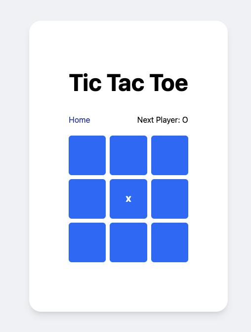
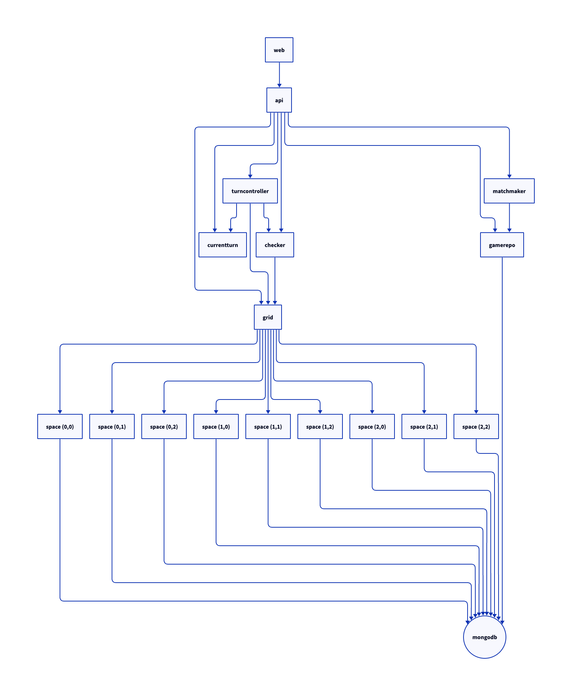

# tic-tac-toverengineered

[](https://github.com/theothertomelliott/tic-tac-toverengineered/actions/workflows/ci.yaml)
[](https://github.com/theothertomelliott/tic-tac-toverengineered/actions/workflows/test.yaml)
[](https://codeclimate.com/github/theothertomelliott/tic-tac-toverengineered/maintainability)
[](https://codeclimate.com/github/theothertomelliott/tic-tac-toverengineered/test_coverage)

A simple Tic Tac Toe game build with an excessive number of microservices.



## Goal

To provide an easy to understand project with a non-trivial number of microservices to try out
monitoring, tracing and observability tooling.

## Architecture


[Diagram in D2 Playground](https://play.d2lang.com/?script=bJFBbsMgEEX3cwqWjdRKzF960bsQghKrtrGooy6q3r0iATwesmMe876_xRyXa7ycB_NLxjyKD8aPyU-B_oh-wtl8fBq3jkRuHfPZ31MKy7bd01LR1c0hhTW2OY2Xes57Pi5bitMUUgu5Bf-1j7Pb_G12mVC5ajlU0x-Lz7ZEu3EoQMfPtZAe1wYvbsQPUrYz_F6dD9aqmdUMJbASWAmsBSgBSgCISpXhScybfbenAllArhAC4lR83n1uPrOA1WcI2HzsPpoPFrD6gIDNt1Y-Z2nfIxwevTTv1rg3-YWJ3kRv4mD-BwAA__8%3D&layout=elk&)

## Technologies

- [Go](https://golang.org/)
- [gRPC](https://grpc.io/)
- [Kubernetes](https://kubernetes.io/)
- [Helm](https://helm.sh/)
- [Tilt](https://tilt.dev/)
- [TailwindCSS](https://tailwindcss.com/)
- [OpenTelemetry](https://opentelemetry.io/)
- [Lightstep](https://lightstep.com/)
- [Playwright](https://playwright.dev/)
- [k6](https://k6.io/)

## Building and Running Locally

You can run all deployments locally using Tilt. Open a terminal in the root directory of the repo and run:

```
tilt up
```

This will build all containers and deploy a Helm chart to your current Kubernetes context, forwarding the web UI to port 8080 on localhost.

Tilt will also automatically run unit tests on any change to the source.

## Deployment

A Helm chart has been provided for direct deployment. To deploy from the command line:

```
helm repo add tic-tac-toverengineered \
    https://theothertomelliott.github.io/tic-tac-toverengineered/

helm repo update

helm install \
    --create-namespace --namespace tictactoe \
    tic-tac-toverengineered/tic-tac-toe --generate-name
```

## Secrets

Secrets are picked up by Tilt from _secrets.yaml_ (which is gitignored). Currently, only a
Lightstep access token is required.

Add the following content to _secrets.yaml_ to enable tracing:

```
lightstep:
  access_token: <access token>
```
